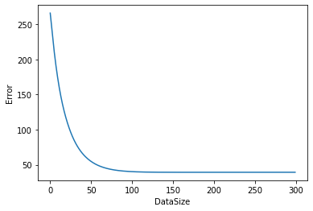

<b>Image orientation classification</b> 
In this assignment we'll study a straightforward image classication task. These days, all modern digital
cameras include a sensor that detects which way the camera is being held when a photo is taken. This meta-
data is then included in the image le, so that image organization programs know the correct orientation |
i.e., which way is up in the image. But for photos scanned in from lm or from older digital cameras,
rotating images to be in the correct orientation must typically be done by hand.
Your task in this assignment is to create a classier that decides the correct orientation of a given image.   
Decision Trees : 
Decision tree was implemented and the max_depth parameter chosen was 4.This was done
after cross-validation. We plotted a graph of accuracy vs max_depth and found out that as we
increase the max_depth parameter the accuracy improves.
We did not increase the depth more than 4 because we had a worry that it may overfit since
increasing the depth of the tree leads to overfitting.
Gini impurity was used instead of entropy since we thought that Gini has no log calculations and
has the same effect as entropy.
One more very important design decision that we made was regarding the selection of the calue
to split on. Since we have continuous values and we have a large number of values in each
column(36000), it’s hard to make a choice on which value to split the tree on since we have to
look at every single pixel hence we used a random number generator and generated 5 values in
the range 0 to 255 and picked the one that gave the best information gain.
The graph of accuracy vs max_depth is shown below:
#please check pic 1.
  
The graph of time taken to build tree vs max_depth is shown below:

#please check pic 2.
K-NN :

Here we use k-nearest neighbours to classify our data into one of the 4 categories(0,90,180,270).

We have have taken the data and made it into 4 parts for our convenience (train set, train label, test set and test label).

Now, since the data is in the vector form, we calculate the euclidean distance between each test point and all the training points. Once this is done we take the lowest ‘k’ distances and find the majority vote, that is get the label of majority of points and assign that to the test point . 

The main challenge we faced was speeding up the finding the euclidean distances. We have made a function that does it by the slow method where  we use two for loops to calculate the distances  , since there  are  37000 training and 1000 test points(approximately) the computation time was really high. 
To tackle this issue we have used the scipy euclidean package which makes this really fast (2 seconds) . 

K-nn is achieving an accuracy of 70 at average . For a better understand we have plotted a k vs accuracy graph.

#please check pic 3.

We see that the best k value for which the accuracy is highest is at k=40.

This is the best performing model for k-nn.

Neural net : 
Objective : to implement neural network from scratch.  

Method : 

Here, we have used activation function as sigmoid. We are using regularization to check the error during backpropogation step. 
We will do first some pre processingg of data by scaling the data and by doing one- hot encoding. 
After that we will do forward and backward propagation.
We have used batches while training of the data . 
We are getting roughly an accuracy of unto 72-75 %.

It is also our best model out of the three models . 

We will recommend to our client to use neural net model as it is yield higher accuracy on the test data of all the three models. 

Here, we will take into consideration running time and accuracy while suggesting to the client. 

Model 											Time                 Accuracy
I would recommend decision trees to have the highest running time. :  4 mins           :  64% accuracy
Neural nets takes about just less than a min to get trained :	       :	 about 1 min.  :  73-75% accuracy
Nearest neighbors takes around 5 seconds to get trained :  	        :  around 5 s    :  71-72% accuracy .

As time taken by neural net is considerably slower and the classification accuracy is the highest I will recommend the client to use neural network as the classification model. 

Here, from analyzing the error we have concluded that there such error is in case of symmetric pictures as the model is not able to classify by how much has been it has it rotated. 

	

